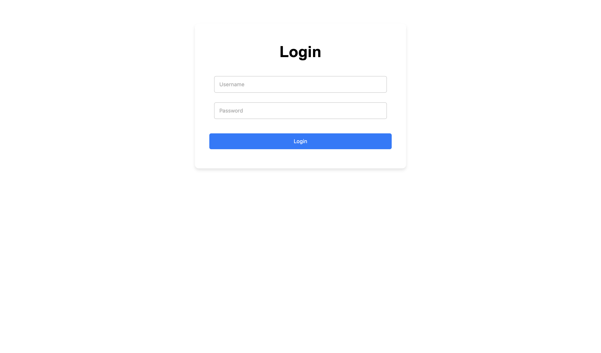
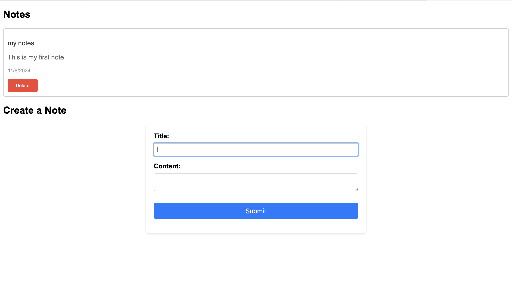

# Project Notes App

A web application for managing project notes, built with Django backend and a Vite-powered frontend.

## Features

- User authentication with JWT (JSON Web Tokens)
- Create, read, update, and delete project notes
- Ability to share notes with other users
- SQLite database for storing note data

## Technologies Used

- **Backend**:
  - Django (version 3.2 or higher)
  - Django REST Framework
  - PyJWT (for JWT authentication)
- **Frontend**:
  - Vite (for building the frontend)
  - Vue.js (version 3 or higher)
  - Axios (for making HTTP requests)
  - Vuex (for state management)

## Getting Started

### Backend Setup

1. Navigate to the `backend` directory:

   ```bash
   cd backend
   ```

2. Install the required Python dependencies:

   ```bash
   pip install -r requirements.txt
   ```

3. Apply the database migrations:

   ```bash
   python manage.py migrate
   ```

4. Start the Django development server:

   ```bash
   python manage.py runserver
   ```

The backend server will be running at `http://localhost:8000`.

### Frontend Setup

1. Navigate to the `frontend` directory:

   ```bash
   cd frontend
   ```

2. Install the required Node.js dependencies:

   ```bash
   npm install
   ```

3. Start the Vite development server:

   ```bash
   npm run dev
   ```

The frontend will be running at `http://localhost:5173`.

## Usage

1. Register a new user account or log in with an existing one.
2. Create a new project note by clicking the "Add Note" button.
3. Edit or delete existing notes as needed.
4. Share notes with other users by clicking the "Share" button and entering their email addresses.

## Preview

